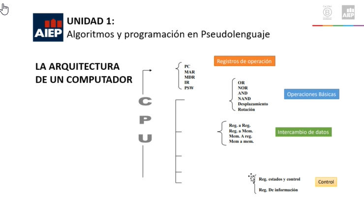
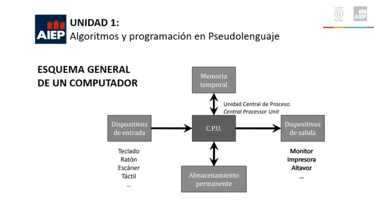
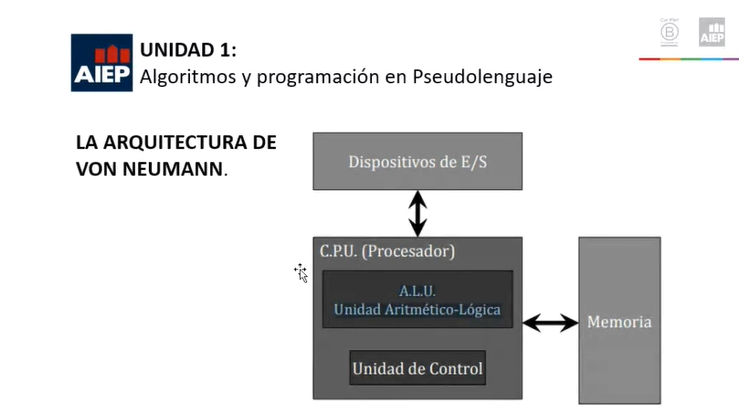
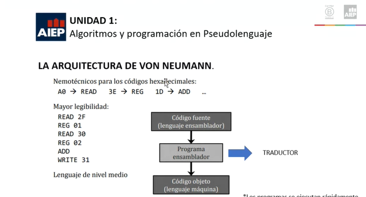
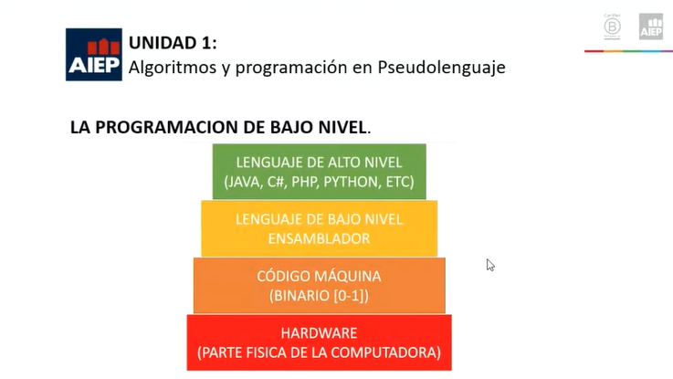

# Notas Fundamentos de la Programación

##### profesor: Antolin Muñoz

##### Correo Profesor: antolin.munoz@correoaiep.cl

##### AIEP Osorno - Marzo 2021

### Contenidos

- Pseudolenguaje y elementos básicos de la programación estructurada, consideran estructuras básicas que conforman un algoritmo.
- DFD, considerando componentes básicos de una programación estructurada.
- Scratch como lenguaje de programación visual.
- Herramientas para la programación.

## Unidad 1: Algoritmos y programación en Pseudolenguaje

### Términos que debemos conocer

#### **Informática**

Informática (Ciencia de la computación) Conjunto de conocimientos científicos y técnicas que hacen posible el tratamiento automático de la información por medio de ordenadores.

#### **Computador**

Maquina electrónica, analógica o digital, dotada de una memoria de gran capacidad y métodos de tratamiento de la información, capaz de resolver problemas matemáticos y lógicos mediante la ejecución de programas informáticos.

#### Contextualicemos

La computación y la informática se encuentra en muchas partes de nuestra vida. Desde levantarnos y tener nuestro dia programado, hasta apagar o encender el televisor, lavadora, etc. o nuestro dispositivo móvil. Desde un simple sistema informático hasta un satélite que procesa y enviá información al instante.

#### **Hardware**

Componentes que integran la parte material o física de un computador.

#### **Software**

Programas, instrucciones y reglas informáticas para ejecutar tareas en una computadora.

#### **Programar**

Indicar a la computadora qué es lo que tiene que hacer

#### **Programa**

- Secuencia de instrucciones
- Instrucciones que entiende la computadora
- Y que persiguen un objetivo: ¡resolver un problema!

#### **Programadores y equipo multidisciplinario con Múltiples roles**

- Gestores
- Analistas
- Diseñadores
- Programadores
- Testers
- Administradores de sistemas

### La Arquitectura de un Computador

Un computador no solo se compone por una parte física y lógica, sino que también cuenta con una arquitectura fundamental para su funcionamiento, la cual es comprender cualquier instrucción, procesar y tener resultados de la misma en el menor tiempo posible.

Para esto existen diferentes componentes y uno de los mas importantes que nos permite interactuar con el hardware es la CPU.

#### **La CPU puede dividirse funcionalmente en 3 subunidades:**

- La unidad de control, dedicada a ciclos de búsqueda y ejecución.
- La ALU (Arithmetic - Logic Unit) que desempeña funciones aritméticas como por ejemplo, suma y resta, y de lógica por ejemplo AND, OR.
- Y un conjunto de registros dedicados al almacenamiento de datos en la CPU y a ciertas funciones de control.

La CPU contiene un conjunto de localidades de almacenamiento temporal de datos de alta velocidad llamada registro. Algunos de los registros están dedicados al control, y solo la unidad de control tiene acceso a ellos. Los registros restantes son los registros de uso general y el programador es el usuario que tiene acceso a ellos.

- Contador de programa (PC).
- Registro de direcciones de la memoria(MAR - Memory Address Register).
- Registro de datos (RD).
- Registro de instrucciones (ER).
- Palabra de estado de programa (PSW).

En el registro de instrucciones de una unidad de procesamiento (CPU) podemos encontrar clasificaciones las cuales nos permiten realizar tareas, el cual es un registro que conserva el código de operación de la instrucción en todo el ciclo de la maquina.

Se clasifican en 5 categorías:

- Instrucciones de aritmética y lógica.
- Instrucciones de movimientos de datos.
- Operaciones de datos en bloques.
- Instrucciones de control del programa.
- Instrucciones de Entrada - Salida.

Instrucciones de Aritmética y Lógica:

- Operaciones binarias, las cuales requieren dos operadores y producen un resultado único.
- La suma, la resta, la multiplicación, y division, son operadores standard en la mayor parte de las maquinas.
- Las operaciones de lógica incluidas en el conjunto de instrucciones son las operaciones AND, NAND, NOR, XAND, XOR.
- También dentro de las instrucciones de aritmética y lógica se encuentra las operaciones de desplazamiento y las de rotación.

### La Arquitectura de Von Neumann

Conocida como modelo Von Neumann, es una arquitectura de computadoras basada en la descrita en 1945 por el matemático y físico John Von Neumann y otros.

Este describe una arquitectura de diseño para una computador digital electrónico con partes que constan de una unidad de procesamiento, unidad aritmético lógica y registros del procesador, unidad de control que contiene un registro de instrucciones y un contador de programa, una memoria para almacenar tanto datos como instrucciones, almacenamiento masivo externo, y mecanismos de entrada y salida.

- Una ALU (Unidad Aritmética-Lógica) es un circuito que permite, como su nombre lo indica, realizar operaciones lógicas y aritméticas.
- Ademas de los operadores lógicos y aritméticos, la ALU cuenta con una serie de registros para almacenar los datos y bits de información sobre los resultados, también llamados banderas.
- Las banderas mas comunes son: Carry, Auxiliary Carry, Borrow, Overflow, Parity, Zero.

### La Programación de Bajo Nivel

**Los procesadores trabajan con ceros y unos (bits)**.

Unidad de memoria basica: Byte (8 bits) (2 dígitos hexadecimales: 01011011 -> 0101 1011 -> 5B).

#### **Lenguaje Máquina**

Códigos hexadecimales que representan instrucciones, registros de la CPU, direcciones de memoria o datos Instrucción - Significado

- A0 2F Acceder a la celda de memoria.
- 2F 3E 01 Copiar el registro 1 de la ALU.
- A0 30 Acceder a la celda de memoria.
- 30 3E 02 Copiar en el registro 2 de la ALU 1D Sumar.
- B3 31 Guardar el resultado en la celda de memoria 31.

#### **Ensamblador:**

El lenguaje **ensamblador** o assembly (.asm) es un lenguaje de **programación** de bajo nivel. Consiste en un conjunto de **mnemónicos** que representan instrucciones básicas para los computadores, microprocesadores, microcontroladores y otros circuitos integrados programables.

Este permite la traducción de una instrucción a lenguaje maquina.

### Que es Programar

Especificar la estructura  y el comportamiento de un programa, así como probar que el programa realiza su tarea adecuadamente y con un rendimiento aceptable.(Decir que tiene que hacer en el menor tiempo posible)

### Lenguaje de Alto Nivel

Un lenguaje de programacion de alto nivel se caracteriza por expresar los algoritmos de una manera adecuada a la capacidad cognitiva humana, en lugar de la capacidad con que los ejecutan las máquinas (0 y 1 Binarios). Estos lenguajes permiten una máxima flexibilidad al programador a la hora de abstraerse o de ser literal.

Existen desde la década de los 50 y nacieron con el objetivo de ir más allá respecto a las limitaciones de los lenguajes de bajo nivel, permitiendo a los usuarios resolver problemas de una forma sencilla y rápida. Desde entonces han aparecido distintos lenguajes de alto nivel y es conveniente conocer, al menos, los principales.

### Que es un Algoritmo

Es un conjunto de instrucciones o reglas definidas y no-ambiguas, ordenadas y finitas que permite solucionar un problema, realizar un cómputo (cálculos), procesar datos y llevar a cabo otras tareas o actividades.

**Pero para que me puede servir un algoritmo?**

A través de un conjunto de instrucciones realizadas en orden conducen a obtener la solución de un problema y sistematizarlo.

### Componentes de un Algoritmo

**Conceptualmente, un algoritmo tiene tres componentes:**

- **Entrada:** Son los datos sobre los que el algoritmo opera.
- **Proceso:** Son los pasos que hay que seguir, utilizando la entrada y debe ser realizado en orden.
- **Salida:** Es el resultado que entrega el algoritmo.

**El proceso es una secuencia de sentencias:**

- **Ciclos:** Grupos de sentencias ejecutadas varias veces.
- **Condiciones:** Grupos de sentencias que sólo son ejecutadas bajo ciertas condiciones.

### Para contextualizar un Algoritmo

La racionalidad es la capacidad que permite pensar, evaluar, entender y actuar de acuerdo a ciertos principios lógicos y de consistencia, con el fin de satisfacer algún objetivo o finalidad.

Nuestro actuar como personas se basa en la capacidad que tiene el ser humano como único ser racional de la naturaleza, somos el único individuo que desarrolla instrucciones secuenciales y lógicas de acuerdo al pensamiento.

### Tipos de Algoritmos

**Existen dos tipos de Algoritmos.**

- **Algoritmos Convencionales:** Que son los que hacen las personas todos los días en sus diferentes actividades para solucionar problemas del trabajo o de la vida cotidiana.
- **Algoritmos Computacionales:** Que son los que utilizan el computador a través de programas diseñados por desarrolladores de software y programadores para dar solución a problemas de cálculo o de manejo de información.

### Para Construir un Algoritmo

Cuando se elabora un algoritmo se debe tener en cuenta lo siguiente.

- Tener claro cuál es el problema que se va a solucionar.
- Establecer un objetivo que permita medir la solución del problema.
- Elaborar un algoritmo que solucione el problema.
- Realizar pruebas al algoritmo para verificar los resultados.

### Componentes de un Algoritmo

**Ejemplo 1:** Algoritmo que permita ir de la casa a la universidad.
**Objetivo:** Ir de la casa a la universidad.

**Inicio.**

1. Salir de la casa.
2. Si está lejos de la universidad entonces tomar un medio de trasporte que lo deje cerca del mismo.
3. Si no está lejos de la universidad entonces dirigirse caminando hacia él mismo.
4. Llegar a la puerta de la universidad.

**Fin.**