# Apuntes de Bases de Datos Relacionales

## Modelamiento de Base de Datos Relacionales

### Concepto de Modelo de Datos

Es un lenguaje orientado a base de datos.

- Estructura de datos de la BD.
- Restricciones de integridad.
- Manipulación de los datos(Operaciones).

### Componentes

Componentes que podemos nombrar:

- Tablas.
- Formularios.
- Consultas.
- Informes.

### Base de Datos

La definición formal de una **Base de Datos** dice que es un conjunto exhaustivo no redundante de datos estructurados, organizados independientemente de su utilización y su implementación en máquinas accesibles en tiempo real y compatibles con usuarios concurrentes con necesidad de información diferente.

### Entidad

Objeto del mundo real, concepto abstracto el cual se distingue de los demás objetos.

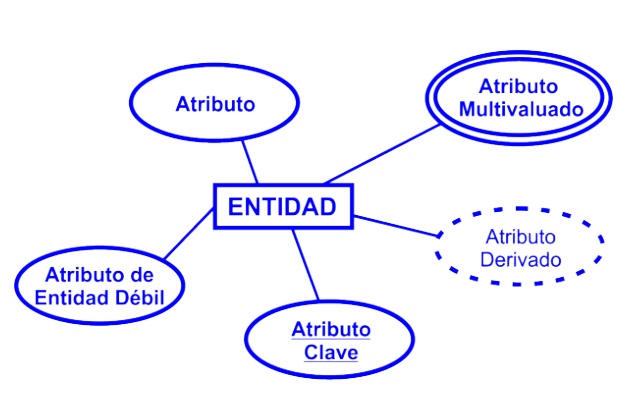

### Atributos

Características o propiedades de una entidad. Cada entidad posee atributos y a cada atributo se le asigna un valor único por cada elemento.

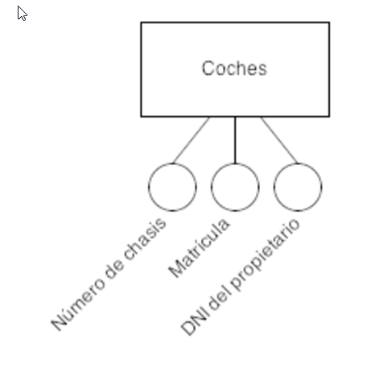

### Relación

Asociación entre diferentes entidades, nos permite definir una dependencia, es decir, nos permite exigir que varias entidades compartan ciertos atributos de forma indispensable.

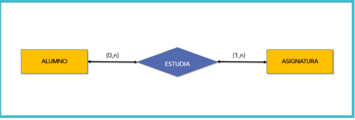

### Cardinalidad

- Es el número de entidades con la cual otra entidad se puede asociar mediante una relación binaria.
- La cantidad puede ser: Uno a uno, uno a muchos o muchos a uno y muchos a muchos.
- El tipo de cardinalidad se representa mediante una etiqueta en el exterior de la relación, respectivamente: "1:1", "1:N" y "N:M", aunque la notación depende del lenguaje utilizado, la que más se usa actualmente es UML

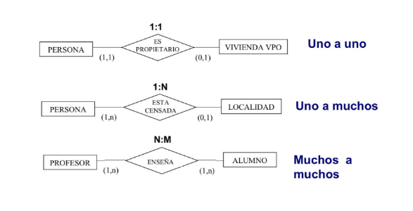

### Dependencias

Es una restricción que se establece entre dos conjuntos de atributos de la **base de datos**. Atributos X e Y que son subconjuntos de R, especifica una restricción en las posibles tuplas que pueden formar un estado de relación r de R.

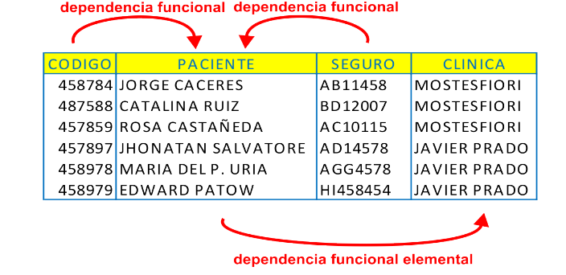

Ejemplo:

- Entidad persona, Rut -> nombre, apellidos, fecha de nacimiento, etc.
- Toda la información se encuentra enlazada a un único RUT (en cada ocasión se realiza una búsqueda, la información queda registrada a ese RUT).
- El nombre, apellidos, fecha de nacimiento, dirección, teléfono, etc. Dependen funcionalmente de RUT.

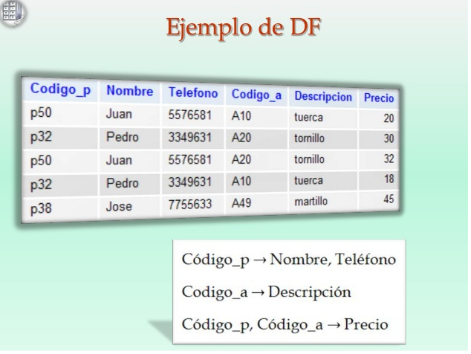

### Tablas

Se refiere al tipo de modelado de datos donde se guardan los datos recogidos por un programa. Su estructura general se asemeja a la vista general de un programa de tablas.

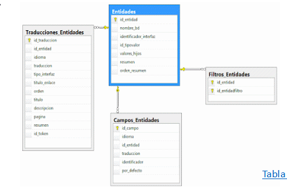

- **Campo**: Corresponde al nombre de la columna, debe ser único y además de tener un tipo de dato asociado.
- **Registro o Tupla**: Corresponde a cada fila que compone la tabla. Ahí se componen los datos y los registros, eventualmente pueden ser nulos en su almacenamiento.

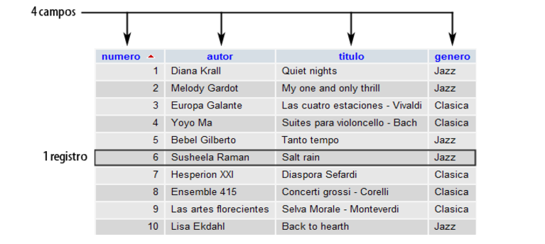

### Clave Primaria

Se llama clave primaria o clave principal a un campo o a una combinación de campos que identifica de forma única a cada fila de una tabla. Una clave primaria comprende de esta manera una columna o conjunto de columnas. No puede haber dos filas en una tabla que tengan la misma clave primaria.

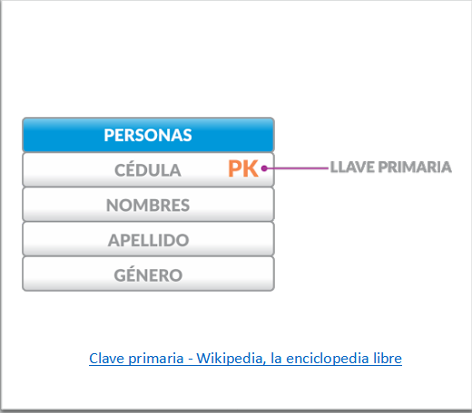

### Clave Foránea

Es una columna o grupo de columnas de una tabla que contiene valores que coinciden con la clave primaria de otra tabla. Las claves foráneas se utilizan para unir tablas.

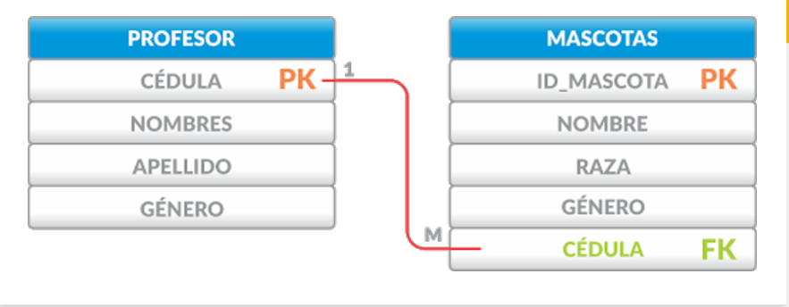

### Dependencias y Claves

- La clave en una relación se identifican y nos sirven para un reconocimiento de DF entre atributos o campos.
- La clave permite distinguir registros dentro de una relación, los cuales determinan funcionalmente a los atributos.
- Claves candidatas se pueden tener varias alternativas dentro de una relación, ejemplo: Factura, numero de boleta, numero de cliente, rut cliente.
- Las claves candidatas determinan a los atributos restantes.
- En una relación pueden existir mas de una clave candidata.
- Una clave candidata puede tener varios atributos a su cargo.
- Clave candidata simple, compuesta por un atributo.
- Clave candidata compuesta, 1 o varios atributos.
- Clave primaria, se selecciona dentro de las candidatas para distinguir las tuplas al interior de una tabla.
- Se selecciona en función de su simplicidad.
- Al existir solo una clave candidata, esta debe ser la  primary key (clave primaria).
- Claves alternas son claves candidatas que no fueron seleccionadas como primarias.
- Claves foráneas compuestas, la clave candidata correspondiente también es compuesta.
- Claves foráneas deben estar definidas sobre el mismo dominio.
- Claves foráneas, hace referencia a la tupla que contiene la clave candidata asociada.

### Integridad Referencial

- **Restricción**: Anular cualquier operación que se ejecute y deje la base de datos sin integridad.
- **Cascada**: Realizar la operación, pero a la vez asegurar que los datos sean legítimos dentro de la base de datos.

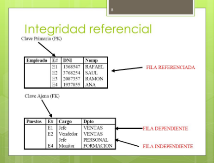

### Índices

Es una estructura de datos que mejora la velocidad de las operaciones, por medio de un identificador único de cada fila de una tabla, permitiendo un rápido acceso a los registros de una tabla en una base de datos.

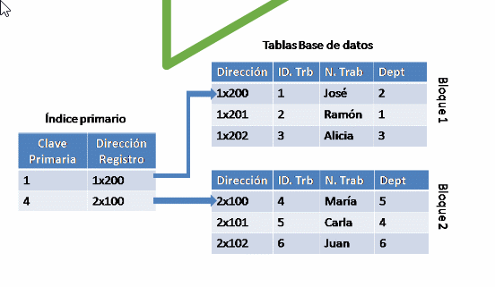

### Datos

Las bases de datos están formadas por un conjunto de datos clasificados según un criterio y almacenadas en un soporte (digital o no) con el fin de ser consultadas y acceder a ellos de manera simple y rápida.

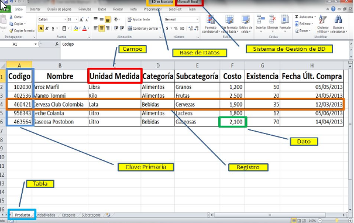

La clasificación implica categorizar o estructurar datos en orden de importancia o relevancia. Generalmente la clasificación se realiza según su sensibilidad (confidencial, restringido, uso general y público).

### Tipos de Datos

Es la propiedad de un valor que determina su dominio (qué valores puede tomar), que operaciones se le pueden aplicar y cómo es representado internamente por el computador.

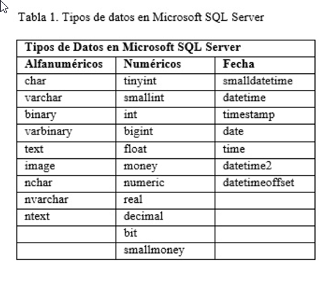

### Sistemas de información

Es un conjunto interconectado de medios, métodos y personal empleado para almacenar, procesar, emitir información para lograr los objetivos de gestión. En las condiciones modernas, el principal medio técnico de procesamiento de información es una computadora personal.

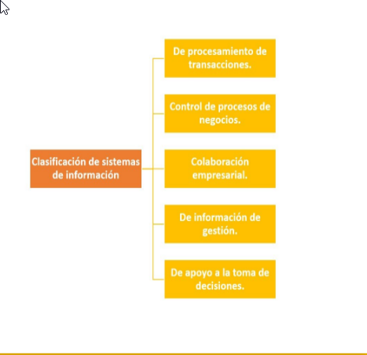

### Ciclo de vida: Bases de Datos

- **Planificación**: Mano de obra, recursos y dinero.
- **Definición sistema**: Limite de la aplicación, interacción entre sistemas.
- **Análisis de requisitos**: Toma de requerimientos para el desarrollo.
- **Diseño de bases de datos**: Conceptual, lógico y físico.
- **DBMS**: Data base management system (SQL Server, Mysql, MariaDB, Oracle, etc).
- **Aplicación**: Realización de el sistema o aplicación, interactúa con la DB.
- **Implementación**: Se utiliza el lenguaje SQL para la implementación de la DB.
- **Migración de Datos**: Etapa utilizada para cambiar el sistema por uno nuevo.
- **Pruebas**: Se realizan validaciones al sistema.
- **Mantenimiento**: Monitoreo y actualización del sistema.

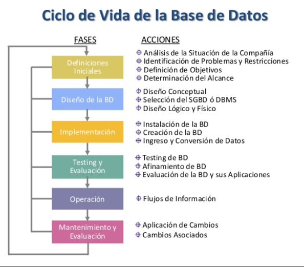

### Modelo de negocio Canvas

Es una herramienta para definir y crear **modelos** de negocio innovadores que simplifica 4 grandes áreas: clientes, oferta, infraestructura y viabilidad económica en un recuadro con 9 divisiones.

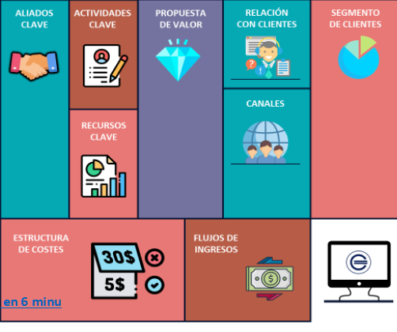

### Arquitectura modelo de datos

Son los modelos, politicas, reglas y estándares que nos indican de qué manera tenemos que almacenar, organizar e integrar los datos que recoge una compañía con el objetivo de que sean aprovechables y útiles.

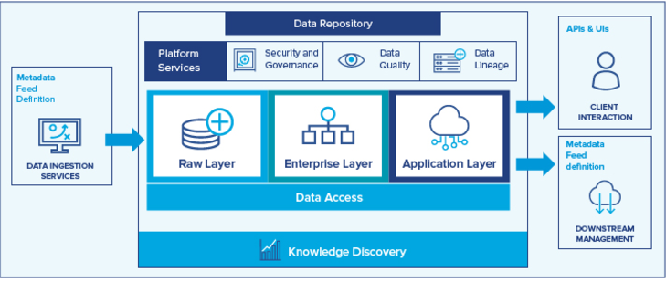

### Análisis de requerimientos

Es un estudio profundo de una necesidad tecnológica que tiene una empresa, organización o negocio. En este proceso, se realiza un análisis exhaustivo del sistema que va a desarrollar. Se definen y aplican técnicas que permitan analizar los requisitos necesarios para su buen desarrollo.

## ¿Que es una abstracción de datos?

- Es una característica de un sistema de base de datos, permite al usuario operar los datos sin necesidad de conocer detalles del sistema que para el no son de importancia, ofreciendo, una visión abstracta de este.
- Existen niveles de abstracción como es el nivel físico, lógico y de vistas.

### Nivel Físico

- Abstracción de nivel bajo
- El almacenamiento es a nivel físico.
- La forma de acceder a los diferentes registros de una BD.

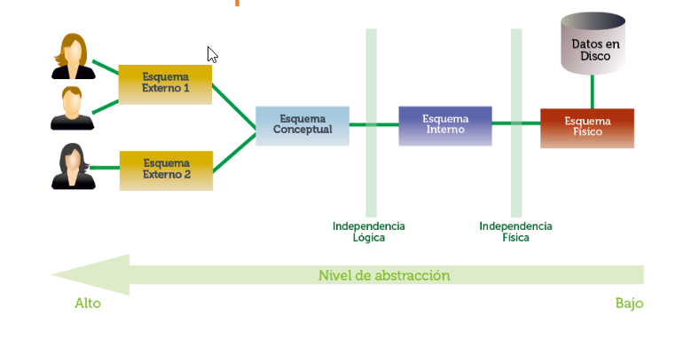

### Nivel Lógico

- Abstracción intermedia.
- Descripción de estructura de la BD.
- Entidades.
- Atributos.
- Relaciones.
- Tipos de datos.

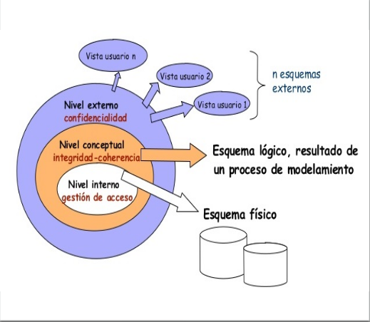

### Nivel de Vista

- Abstracción nivel alto.
- Los datos se convierten en información.
- Consultas ya definidas para el usuario (Querys).
- El usuario recopila la información de forma ordenada.
- El usuario del sistema no tiene acceso al nivel lógico y físico.

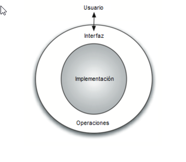

### Modelamiento de datos conceptuales

El modelado conceptual de datos representa las entidades importantes y sus relaciones para explorar los conceptos de dominio con interesados en el proyecto que definen el ámbito del problema que tratará la solución del sistema.

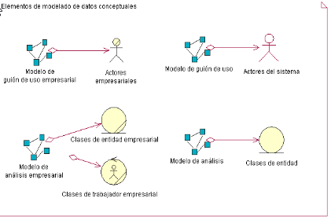

### Mapas Conceptuales

El mapa conceptual consiste en una sinopsis gráfica sobre un tema en concreto. Es una técnica usada normalmente por estudiantes para resumir y completar fácilmente todas las partes y ramificaciones de un tema y sus relaciones.

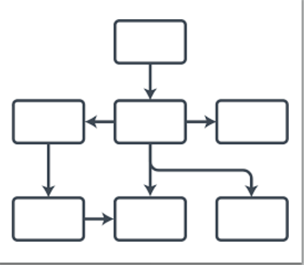

### Diagrama de flujo de datos

Traza el flujo de la información para cualquier proceso o sistema. Emplea símbolos definidos, como rectángulos, círculos y flechas, además de etiquetas de texto breves, para mostrar las entradas y salidas de datos, los puntos de almacenamiento y las rutas entre cada destino.

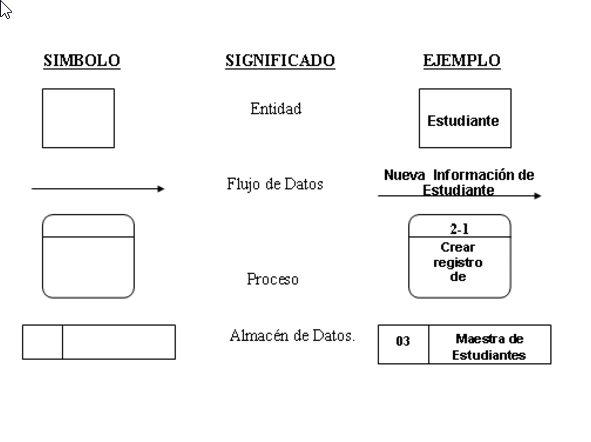

### UML

Es un lenguaje gráfico para visualizar, especificar, construir y documentar un sistema.

Es importante remarcar que UML es un "lenguaje de modelado" para especificar o para describir métodos o procesos.

Se utiliza para definir un sistema, para detallar los artefactos en el sistema y para documentar y construir.