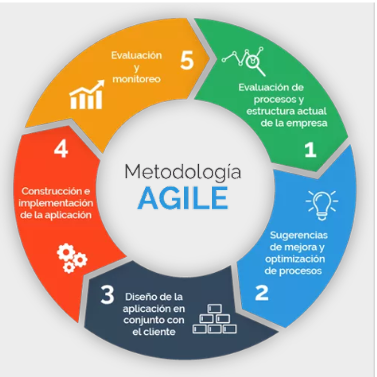

# Notas Introducción a Requerimientos y Modelos de Negocios

##### Profesor: Diego Coronado

##### AIEP Osorno Marzo/Abril 2021

### Contenidos

**Unidad de competencias:** Al finalizar el modulo, los participantes serán capaces de realizar especificaciones de requerimientos funcionales y no funcionales de software, aplicando estrategias de recolección de datos mediante el modelamiento de procesos de negocio (**BPMN**), según las de la organización.

**Contenidos:**

Organizan requerimientos funcionales y no funcionales a partir de técnicas de obtención de requisitos del ciclo de vida de un software, considerando problemática y tipo de organización

- Definiciones de desarrollo de un software y su ciclo de vida.
- Requerimientos funcionales y no funcionales de distintos tipos de organizaciones.
- Tipos de problemáticas según los tipos de organizaciones: Sociales, empresariales o gubernamentales.
- Procesos incrementales.
- Técnicas de obtención de requerimientos: Entrevistas, reuniones, cuestionarios, escenario, prototipos, arqueología de sistemas, Thinking Design.
- Pirámide de requerimientos según las metodologías ágiles (desde las necesidades de usuario hasta los requisitos de software).

Aplican técnicas de identificación y validación de requerimientos en el ámbito de la elaboración del software.

- Instrumentos de obtención de los requerimientos funcionales y no funcionales (explicación de los roles de los actores y de los casos de uso, y como se relacionan entre ellos).
- Técnicas de elaboración de instrumentos efectivos para la toma de requerimientos.
- Técnicas de validación de los instrumentos de obtención de requerimientos.
- Validación de requerimientos funcionales y no funcionales.
- Resultados de requerimientos funcionales y no funcionales.

Realizan levantamientos de requisitos de software acorde a las problemáticas especificas dentro de una organización, considerando un enfoque iterativo.

- Enfoque iterativo dentro de un equipo de desarrollo de software según las metodologías ágiles.
- Las iteraciones dentro de un ciclo de vida de un software.
- El proceso ágil de desarrollo de software.
- Introducción a UML: Casos de uso / Diagrama de secuencias / Diagrama de actividad.
- Metodologías ágiles SCRUM y XP.
- DFD (Diagramas de Flujo de Datos).

Caracterizan objetivo del modelado de los procesos de negocio, considerando el desarrollo ágil de soluciones a las necesidades de los distintos tipos de organizaciones.

- Diagramas para el modelado de los procesos de negocio.
- Tipos de arquitectura de negocios dentro de las organizaciones (Sociales, Empresa y gobierno).
- Procesos de negocio y gobernabilidad para el desarrollo ágil.
- Diagramación de los procesos de negocio dentro de las organizaciones (Casos de Uso, diagramas de actividad, diagramas de secuencias, etc.)

Relacionan cultura ágil con desarrollos de soluciones a los distintos procesos de negocio.

- Delimitando el alcance del proyecto dentro del desarrollo de software según las metodologías ágiles.
- Comunicación con el cliente dentro de un equipo de desarrollo de software según las metodologías ágiles.
- La cultura ágil: (Valores, principios y practica).
- Valores y creencias de la cultura ágil.
- Principios y modelos mentales de la cultura ágil.
- Comportamiento y artefactos en la cultura ágil.
- Pirámide de la cultura ágil.

Aplican técnicas para la descripción de procesos de negocio mediante diagramas de cosos de uso y de actividades.

- Elementos del modelo de casos de uso en el modelado de procesos de negocio.
- Objetivo del diagrama de actividades en el modelado de los procesos de negocio.
- Especificaciones de los diagramas de actividades en el modelado de los procesos de negocio.

## Unidad 1: Requerimientos de Software

### ¿De qué trata el Desarrollo de Software?

Esto es la programación lógica que todo sistema de cómputo necesita para funcionar correctamente y permitir al usuario disfrutar de aspectos como una interfaz amigable y rápida, asi como las funciones que el programa realice.

Ahora el Desarrollo de Software estudia los componentes necesarios para la creación, gestión, mantenimiento y testeo de Software computacional; a la persona encargada de esto se le llama programador y este es un especialista en informática, capaz de elaborar sistemas informáticos (paquetes de Software), así como de implementarlos y ponerlos a funcionar, utilizando uno o varios lenguajes de programación.

### Problemas en el desarrollo

Una de las mayores deficiencias en la construcción de software es la poca atención que se presenta en la discusión del problema.

En general los desarrolladores se concentran en la solución dejando el problema inexplorado, en consecuencia el problema a resolver debe ser deducido a partir de su solución.

Perder de vista el origen de un problema puede provocar que la aparición de nuevos problemas no se detecten a tiempo y en consecuencia interfieran con la solución inicial.

### ¿Qué es el ciclo de vida del Software?

El ciclo de vida del desarrollo del Software (también conocido como SDLC O Systems Development Life Cycle) contempla las fases necesarias para validar el desarrollo del software y así garantizar que este cumpla los requisitos para la aplicación y verificación de los procedimientos de desarrollo, asegurándose de que los métodos usados son apropiados.

Su origen radica en que es muy costoso rectificar los posibles errores que se detectan tarde en la fase de implementación. Utilizando metodologías apropiadas, se podría detectar a tiempo para que los programadores puedan centrarse en la calidad del software, cumpliendo los plazos y los costes asociados.

### Fases del proceso de desarrollo de Software

Las fases del desarrollo de Software son los procesos a seguir sistemáticamente para idear, implementar y mantener un producto de Software desde que surge la necesidad del producto hasta que se cumple el objetivo por el cual fue creado.

De esta forma, las etapas del desarrollo de software son las siguientes:

- Planificación.
- Análisis.
- Diseño.
- Desarrollo.
- Pruebas.
- Implementación.
- Mantenimiento.

#### 1. Planificación

En esta fase se prepara el diseño y posterior implementación del sistema. Es necesario definir el alcance del proyecto, justificarlo y escoger una metodología para su desarrollo. También es preciso asociar las diferentes actividades a plazos de tiempo y designar roles y responsabilidades.

#### 2. Análisis

Por supuesto, hay que averiguar qué es exactamente lo que tiene que hacer el software. Por eso, la etapa de análisis en el ciclo de vida del Software corresponde al proceso a través del cual se intenta descubrir qué es lo que realmente se necesita y se llega a una comprensión adecuada de los requerimientos del sistema (las características que el sistema debe poseer).

#### 3. Diseño

En este estadio el equipo de proyecto tendrá que determinar cómo el nuevo sistema cumplirá con los requisitos recolectados. Es por ello que se debe identificar soluciones potenciales, evaluarlas y elegir la más conveniente. Ésta será o la más efectiva, o la más eficiente en costes o la menos compleja. Una vez completadas esas tareas, habrá que continuar haciendo la selección tecnológica de Software y Hardware.

#### 4. Desarrollo

El desarrollo de Software marca un antes y un después en la vida del sistema y significa, además, el inicio de la producción. El cambio es una constante durante esta etapa, en la que suele ser recomendable poner el foco en la formación y capacitación de los usuarios y el equipo técnico.

#### 5. Pruebas

Como errar es humano, la fase de pruebas del ciclo de vida del Software busca detectar los fallos cometidos en las etapas anteriores para corregirlos. Por supuesto, lo ideal es hacerlo antes de que el usuario final se los encuentre. Se dice que una prueba es un éxito si se detecta algún error.

Es recomendable que las pruebas sean realizadas por una persona distinta al programador, lo que no quiere decir que el programador no deba hacer sus propias pruebas.

#### 6. Implementación

En esta etapa del ciclo de vida de un sistema de información hay que proceder a la instalación del Hardware y Software elegidos, someterlos a pruebas, crear la documentación pertinente y capacitar a los usuarios. La conversión de datos es importante en este estadio, en el que ya se empieza a trabajar en el nuevo sistema.

Es posible que haya componentes que funcionen correctamente por separado, pero que al combinarlo provoquen problemas. Por ello, hay que usar combinaciones conocidas que no causen problemas de compatibilidad.

#### 7. Mantenimiento

Esta es una de las fases más importantes del ciclo de vida de desarrollo del Software. Puesto que el Software ni se rompo ni se desgasta con el uso, su mantenimiento incluye tres puntos diferenciados:

- Eliminar los defectos detectados durante su vida útil (mantenimiento correctivo).
- Adaptarlo a nuevas necesidades (mantenimiento adaptativo).
- Añadirle nuevas funcionalidades (mantenimiento perfectivo).

Aunque suene contradictorio, cuando mejor es el Software más tiempo hay que invertir en su mantenimiento. La principal razón es que se usará más (incluso de formas que no se habían previsto) y, por ende, habrá más propuestas de mejoras.

### Tipos de Organizaciones

Al hablar de organizaciones económicas comúnmente se piensa sólo en aquellas cuyo objetivo final es la generación de utilidades, pero en realidad existen organizaciones cuyos objetivos no se limitan a ese esquema.

A continuación las características de tres tipos de organizaciones económicas que juegan un papel relevante dentro de la actividad económica de un país:

- Organizaciones empresariales.
- Organizaciones sociales.
- Organizaciones gubernamentales.

-------------------------------------------------------------------------------------------------

## Repaso para Prueba de Metodologías Ágiles

Material de estudio para la prueba

## Desarrollo iterativo e incremental

En un desarrollo iterativo e incremental el proyecto se planifica en diversos bloques temporales llamados iteraciones.

Las iteraciones se pueden entender como miniproyectos: en todas las iteraciones se repite un proceso de trabajo similar (de ahí el nombre "iterativo") para proporcionar un resultado completo sobre producto final, de manera que el cliente pueda obtener los beneficios del proyecto de forma incremental.

### Desarrollo incremental

Para ello, cada requisito se debe completar en una única iteración: el equipo debe realizar todas las tareas necesarias para completarlo (incluyendo pruebas y documentación) y que esté preparado para ser entregado al cliente con el mínimo esfuerzo necesario. De esta manera no se deja para el final del proyecto ninguna actividad arriesgada relacionada con la entrega de requisitos.

Para ello, cada requisito se debe completar en una única iteración: el equipo debe realizar todas las tareas necesarias para completarlo (incluyendo pruebas y documentación) y que esté preparado para ser entregado al cliente con el mínimo esfuerzo necesario. De esta manera no se deja para el final del proyecto ninguna actividad arriesgada relacionada con la entrega de requisitos.

#### Beneficios

- Se puede gestionar las expectativas del cliente (requisitos desarrollados, velocidad de desarrollo, calidad) de manera regular, puede tomar decisiones en cada iteración. Esto es especialmente interesante cuando:
  - El cliente no sabe exactamente qué es lo que necesita, lo va sabiendo conforme va viendo cuales son los resultados del proyecto.
  - El cliente necesita hacer cambios a corto plazo (nuevos requisitos o a cambios en los ya realizados) por:
    - Cambios en las condiciones del mercado (por un cambio de necesidades, por un nuevo producto que ha lanzado la competencia, urgencias).
    - La reacción y aceptación del mercado respecto al uso de los primeros resultados del proyecto.
    - Cualquier cambio en el entorno (recursos, etc.), que pueda incluso finalizar el proyecto manteniendo como mínimo los resultados alcanzados hasta ese momento.
  - El cliente puede obtener resultados importantes y usables ya desde las primeras iteraciones.
  - La finalizacion de cada iteración es el lugar natural donde el equipo puede decidir cómo mejorar su proceso de trabajo, en función de la experiencia obtenida. Con esta información ya es posible planificar iteraciones. Ver en Retrospectiva.
  - Permite conocer el progreso real del proyecto desde las primeras iteraciones y extrapolar si su finalizacion es viable en la fecha prevista. El cliente puede decidir re priorizar los requisitos del proyecto, añadir nuevos equipos, cancelarlo, etc.
  - Dado que cada iteración debe dar como resultado requisitos terminados, se minimiza el número de errores que se producen en el desarrollo y se aumenta la calidad.

#### Restricciones

- La disponibilidad del cliente debe ser alta durante todo el proyecto dado que participa de manera continua:
  - El inicio de una iteración, el cliente ha de detallar (o haber detallado previamente) los requisitos que se van a desarrollar.
  - En la finalizacion de cada iteración, el cliente ha de revisar los requisitos desarrollados.
- La relación con el cliente ha de estar basada en los principios de **colaboración y ganar/ganar** más que tratarse de una relación contractual en la cual cada parte únicamente defiende su beneficio a corto plazo.
- Cada iteración debe dar como resultado requisitos terminados, de manera que el resultado sea realmente útil para el cliente y no deje tareas pendientes para futuras iteraciones o para la finalización del proyecto.

#### Recomendaciones

- Utilizar iteraciones cortas de 2 a 4 semanas incrementa la productividad del proyecto, dado que el equipo trabaja de forma más eficiente cuando tiene objetivos a corto plazo. Asimismo, con iteraciones cortas la precisión de las estimaciones aumenta. El tamaño depende de:
  - Las condicionantes del proyecto.
  - La necesidad de tener feedback más o menos rápido.
  - Que no se degrade la relación trabajo útil / gestión operativa (por ejemplo reuniones, actividades necesarias que no producen valor directo, etc.)
- Utilizar iteraciones regulares, de manera que todas sean un timebox de la misma duración.
  - El equipo aprende a calcular la velocidad de desarrollo, la cantidad de trabajo que puede hacer en una iteración (sin tener que hacer extrapolaciones si las iteraciones no fuesen regulares)
  - El cliente puede proyectar cuantas iteraciones se necesitan para tener cada entrega, en función de la velocidad de desarrollo del equipo (el trabajo que pudo completar en iteraciones anteriores del mismo tamaño), y tomar decisiones al respecto.
  - Permite gestionar y sincronizar de manera sencilla las necesidades del proyecto con respecto a las de otros proyectos (integración con el trabajo realizado por otros equipos, compartición de personas que son difíciles de asignar a un único equipo)

---------------------------------------------------------------------------------------------------------------------

### Desarrollo Iterativo

- No entrega prototipos esta mas enfocado en el proceso de desarrollo y en el feedback que pueden obtener al finalizar cada iteración.

### Desarrollo Incremental

- Se enfoca en la relación con el cliente y en la retroalimentación que esta pueda proporcionar gracias a la liberación de prototipos al finalizar cada iteración.

---------------------------------------------------------------------------------------------------------------------

## Metodologías Ágiles

## Metodología Scrum

La metodología Scrum es un marco de trabajo o framework que se utiliza dentro de equipos que manejan proyectos complejos. Es decir, se trata de una metodología de trabajo ágil que tiene como finalidad la entrega de valor en períodos cortos de tiempo y para ello se basa en tres pilares: la transparencia, inspección y adaptación. Esto permite al cliente, junto con su equipo comercial, insertar el producto en el mercado pronto, rápido y empezar a obtener ventas.

Los pilares o características de la metodología Scrum más importante son 3

1. **Transparencia**: Con el método Scrum todos los implicados tienen conocimiento de qué ocurre en el proyecto y cómo ocurre. Esto hace que haya un entendimiento "común" del proyecto, una visión global.
2. **Inspección**: Los miembros del equipo Scrum frecuentemente inspeccionan el progreso para detectar posibles problemas. La inspección no es un examen diario, sino una forma de saber que el trabajo fluye y que el equipo funciona de manera auto-organizada.
3. **Adaptación**: Cuando hay algo que cambiar, el equipo se ajusta para conseguir el objetivo del sprint. Esta es la clave para conseguir el éxito en proyectos complejos, donde los requisitos son cambiantes o poco definidos y en donde la adaptación, la innovación, la complejidad y flexibilidad son fundamentales.

## Roles de la Metodología Scrum

Con la **metodología Scrum**, el equipo tiene como foco entregar valor y ofrecer resultados de calidad que permitan cumplir los objetivos de negocio del cliente.

Para ello, los equipos de Scrum son **autoorganizados y multifuncionales**. Es decir, cada uno es responsable de unas tareas determinadas y de terminarlas en los tiempos acordados. Esto garantiza la entrega de valor del equipo completo, sin necesidad de ayuda o la supervisión minuciosa de otros miembros de la organización.

En Scrum existen 3 roles muy importantes:

- Product Owner
- Scrum Master
- Equipo de Desarrollo.

### Product Owner

Es el responsable de maximizar el valor del trabajo del equipo de desarrollo. La maximización del valor del trabajo viene de la mano de una buena gestión del **Product Backlog**.

El **Product Owner** es el único perfil que habla constantemente con el cliente, lo que le obliga a tener muchos conocimientos sobre negocio.

Para finalizar, un **equipo Scrum** debe tener solo un **Product Owner** y este puede ser parte del equipo de desarrollo.

### Scrum Master

Es el responsable de que las **técnicas Scrum** sean comprendidas y aplicadas en la organización. Es el manager de Scrum, un líder que se encarga de eliminar impedimentos o inconvenientes que tenga el equipo dentro de un sprint.

Dentro de la organización, el **Scrum Master** tiene la labor de ayudar el la adopción de esta metodología en todos los equipos.

### Equipo de Desarrollo

Son los encargados de realizar las **tareas priorizadas por el Product Owner**. Es un equipo multifuncional y auto-organizado. Son los únicos que estiman las tareas del **product backlog**, sin dejarse influenciar por nadie.

Los **equipos de desarrollo** no tienen sub-equipos o especialistas. La finalidad de esto es transmitir la responsabilidad compartida si no se llegan a realizar todas las tareas de un sprint.

#### **Los Hitos de la Metodología Scrum**

El desarrollo iterativo se realiza en un sprint, que contiene los siguientes eventos:

- Sprint Planning.
- Daily Meeting.
- Sprint Review.
- Sprint Retrospective.

- **Sprint:** El sprint es el corazón de Scrum, es el contenedor de los demás hitos del proceso. Todo lo que ocurre en una iteración para entregar valor está dentro de un sprint. La duración máxima es de un mes, el tiempo se determina en base al nivel de comunicación que el cliente quiere tener con el equipo. Los sprints largos pueden hacer que se pierda feedback valioso del cliente y poner en peligro el proyecto.

- **Sprint Planning:** En esta primera reunión que se hace en el sprint **puede llegar a tener una duración de 8 horas para sprints de un mes**.

El equipo hace las siguientes preguntas:

- **¿Qué se va a hacer en el sprint?** En base a ello, se eligen tareas del Product Backlog.
- **¿Cómo lo vamos a hacer?** El equipo de desarrollo define las tareas necesarias para completar cada ítem elegido del Product Backlog.

La definición de qué se va a hacer implica que con la entrega de valor que se hará al cliente al final **el equipo tenga un objetivo y se encuentre comprometido** del sprint. A esto se le llama sprint goal.

El resultado de esta reunión es el **sprint goal y un sprint backlog**.

- **Daily Meeting:** Es un reunión diaria dentro del sprint que tiene **como máximo 15 minutos de duración.** En ella debe participar, si o si, el **equipo de desarrollo y el Scrum Master**. El Product Owner no tiene necesidad de estar presente.

En esta reunión diaria el equipo de desarrollo hace las siguientes tres preguntas:

**¿Qué hice ayer?**

**¿Que voy a hacer hoy?**

**¿Tengo algún impedimento que necesito que me solucionen?**

Esta reunión es la más oportuna para poder inspeccionar el trabajo y poder adaptarse en caso de que haya cambio de tareas dentro de un sprint.

- **Sprint Review:** La review del valor que vamos a entregar al cliente se hace en esta reunión, al final de cada sprint. Su duración es de **4 horas para sprints de un mes**, y es la única reunión de Scrum a la que puede asistir el cliente. En ella el Product Owner **presenta lo desarrollado al cliente** y el equipo de desarrollo **muestra su funcionamiento**. El cliente valida los cambios realizados y además brinda feedback sobre nuevas tareas que el Product Owner tendrá que agregar al Product Backlog.
- **Sprint Retrospective:** La retrospectiva es el último evento de Scrum, tiene una duración de 3 horas para Sprints de un mes, y es la reunión del equipo en la que se hace una evaluación de cómo se ha implementado la **metodología Scrum** en el último sprint.

Es una gran oportunidad para el **equipo Scrum** de inspeccionarse a sí mismo, proponiendo mejoras para el siguiente sprint.

El resultado: una lista de mejoras que debe aplicar el siguiente día, ya que al finalizar la retrospectiva, inmediatamente comienza un nuevo sprint, que incluye el sprint planning, daily meeting, sprint review y la ya mencionada sprint retrospective.

## Herramientas para la metodología Scrum

Las herramientas que se utilizan en Scrum están definidas para maximizar la transparencia dentro del equipo; es decir, que todos tengan una misma visión de lo que está ocurriendo en el proyecto.

Las herramientas principales de Scrum son:

- Product Backlog
- Sprint Backlog

- **Product backlog:** Básicamente, el product backlog es el listado de tareas que engloba todo un proyecto. Cualquier cosa que debamos hacer debe estar en el product backlog y con un tiempo estimado por el equipo de desarrollo.

La responsabilidad exclusiva de ordenar el product backlog es del Product Owner, que se encuentra en constante comunicación con el cliente para asegurarse de que las prioridades están bien establecidas.

Las tareas que están más arriba deben de ser las de mayor prioridad.

El equipo de desarrollo elige tareas del product backlog en el sprint planning para generar tanto el sprint backlog como el sprint goal.

- **Sprint backlog:** Es el grupo de tareas del product backlog que el equipo de desarrollo elige en el sprint planning junto con el plan para poder desarrollarlas. Debe ser conocido por todo el equipo, para asegurarse de que el foco debe estar en este grupo de tareas.

El sprint planning no cambia durante el sprint, solo se permite cambiar el plan para poder desarrollarlas.

### Ventajas de la metodología Scrum

- Scrum es muy **fácil de aprender:** los roles, hitos y herramientas son claros y tienen un objetivo por lo que es un método muy relacionado con nuestra manera diaria de trabajar.
- El cliente puede comenzar a **usar el producto rápidamente**.
- Se agiliza el proceso, ya que la entrega de valor es muy frecuente.
- Menor probabilidad de sorpresas o imprevistos, porque el cliente está viendo frecuentemente el proyecto.

### Desventajas de la metodología Scrum

- Aunque Scrum sea fácil de aprender, es muy **difícil implementarlo**. Esto supone una predisposición y un cambio de cultura de la organización que debe ir desde los altos mandos hasta los clientes.
- La necesidad de tener **equipos multidisciplinares** puede ser un problema, ya que es difícil encontrar personas que sean capaces de hacer todo el trabajo de un equipo.
- El equipo puede tender a realizar el camino más corto para conseguir el objetivo de un sprint, el cual no siempre ofrece resultados de calidad.

## Metodología Programación Extrema (XP)

La programación extrema es una metodología de desarrollo ágil que tiene como principal objetivo aumentar la productividad a la hora de desarrollar un proyecto de software. Da prioridad a los trabajos que dan un resultado directo y en los cuales se reduce la burocracia que pueda existir en el entorno de trabajo.

### El modelo

La metodología XP define cuatro variables para cualquier proyecto de software: costo, tiempo, calidad y alcance. El método especifica que de estas cuatro variables, tres de ellas podrán ser fijadas arbitrariamente por actores externos al grupo de desarrolladores (clientes y jefes de proyecto), y el valor de la restante deberá ser establecida por el equipo de desarrollo, quien establecerá si valor en función de las otras tres.

Por ejemplo, si el cliente establece el alcance y la calidad, y el jefe de proyecto el precio, el grupo de desarrollo tendrá libertad para determinar el tiempo que durará el proyecto. Se trata de establecer un equilibrio entre las cuatro variables del proyecto.

### El Ciclo de Vida

Al igual que otras metodologías de gestión de proyectos, tanto ágiles como tradicionales, el ciclo XP incluye:

- Entender lo que el cliente necesita > Fase de Exploración.
- Estimar el esfuerzo > Fase de Planificación.
- Crear la solución > Fase de Iteraciones.
- Entregar el producto final al cliente > Fase de puesta en producción.

En cada iteración se realiza un ciclo completo de análisis, diseño, desarrollo y pruebas, pero utilizando u conjunto de reglas y prácticas especificas de XP. Un proyecto con XP, implica de entre 10 a 15 iteraciones habitualmente.

## Equipos de Programación Extrema

**Lista del equipo XP:**

Como toda metodología ágil, esta metodología de Programación Extrema XP, tiene su equipo definido.

- **El cliente ejerce así su responsabilidad:** Los clientes son los responsables de definir los objetivos del proyecto, así como de conducir su gestión. Marcan las necesidades y las prioridades en el proyecto.
- **Los programadores y su marco de acción:** Como especialistas en las actividades que ayudarán a cumplir los objetivos, los programadores serán los encargados de delimitar duraciones y estimar tiempos. Por lo que planificarán el proyecto, con respecto a los requisitos acordados con los clientes
- **Los testers amplían su rol en la XP:** La comunicación del Tester con el cliente será vital para alinear resultados con requisitos estimados.
- **El tracker o encargado de seguimiento:** Su objetivo será que en todo momento haya un control y un por qué se realiza cada cosa. También la comunicación y relación constante con el cliente es clave. Definirá los hitos o puntos de control en la planificación, en función de los objetivos del cliente y las estimaciones de tiempos de ejecución de tareas del equipo de programadores.
- **El coach y su labor clave:** Los coach realizan una tarea fundamental: el asesoramiento y orientación continuo tanto para el equipo de trabajo como para los clientes. Son la guía del proyecto, para que todos sepan bien qué, cómo y cuándo hacerlo.
- **El manager XP responde así a este método:** El responsable de coordinar comunicaciones entre las distintas partes, ofrecer y gestionar los recursos necesarios. De tener una idea general del funcionamiento del proyecto y su estado en todo momento.

### Metodología XP: Fases

1. **Planificación:** Según la identificación de las historias de usuario, se priorizan y se descomponen en mini-versiones. La planificación se va a ir revisando. Cada dos semanas aproximadamente de iteración, se debe obtener un software útil, funcional, listo para probar y lanzar
2. **Diseño:** En este paso se intentará trabajar con un código sencillo, haciendo lo mínimo imprescindible para que funcione. Se obtendrá el prototipo. Además, para el diseño del software orientado a objetos, se crearán tarjetas CRC (Clase-Responsabilidad-Colaboración)
3. **Codificación \<DE TODOS>:** La programación aquí se hace *a dos manos*, en parejas en frente del mismo ordenador. Incluso, a veces se intercambian las parejas. De esta forma, nos aseguramos que se realice un código más universal, con el que cualquier otro programador podría trabajar y entender. Y es que debe parecer que ha sido realizado por una única persona. Así se conseguirá una programación organizada y planificada.
4. **Pruebas:** Se deben realizar pruebas automáticas continuamente. Al tratarse normalmente de proyectos a corto plazo, este testeo automatizado y constante es clave. Además, el propio cliente puede hacer pruebas, proponer nuevas pruebas e ir validando las mini-versiones.
5. **Lanzamiento:** Si hemos llegado a este punto, significa que hemos probado todas las historias de usuario o mini-versiones con éxito, ajustándonos a los requerimientos del cliente. Tenemos un software útil y podemos incorporarlo en el producto.

---------------------------------------------------------------------------------------------------------------------

## Repaso para prueba BPMN/BPM

## BPM (Business Process Management)

### **Arquitectura de Negocios:**

Es el diseño de una operación de negocios, normalmente descrita en términos de capacidades empresariales y capacidades de tecnología de soporte. Este diseño es conceptual y se utiliza para determinar cómo una empresa tendrá que cambiar para apoyar una tragedia dada.

### **¿Que es BPM?**

BPM (Business Process Management), o Gestión de Procesos de Negocio, es una disciplina (que combina tecnologías y metodologías), que tiene como fin mejorar los procesos de negocio que sustentan la operación de las organizaciones.

Se basa en un ciclo de mejora continua compuesto de cuatro etapas:

1. Modelar los procesos mediante un diagrama en una notación gráfica (como ser el estándar **BPMN** por ejemplo), que permita visualizar y discutir cómo funcionan.
2. Automatizar los procesos utilizando un BPM Suite, donde los diferentes participantes de cada etapa puedan hacer su parte del trabajo.
3. Medir tiempos y cantidades de trabajo realizadas utilizando indicadores de rendimiento, para extraer conclusiones objetivas sobre dónde mejorar.
4. Optimizar, introducir las mejoras derivadas del análisis anterior para mejorar el proceso, y volver al punto 1.

### **Proceso de Negocio:**

Un proceso de negocio es una secuencia de actividades que se realizan en una empresa para lograr alguno de sus objetivos. Por lo general un proceso de negocio involucra a varias personas que colaboran cada uno en una etapa diferente del proceso. Por ello, para entender ¿Que es BPM?, primero deberemos identificar los procesos que sustentan la operación de la organización. Luego, entender cómo funciona cada uno de ellos. A partir de ello, podremos automatizarlos y mejorarlos.

### **Ejemplo**

Imaginemos que su empresa recibe solicitudes de cotización de sus productos por diferentes medios: mail, teléfono o web en su call center o por medio de un equipo de vendedores en la calle y contacto directo con los clientes. En cualquier caso, luego de recibida la solicitud, es asignada a un vendedor, quien se dedica a comunicarse con el cliente para conocer mejor sus necesidades y construir una propuesta comercial que las atienda. Hay propuestas estándar, que van directo al cliente via mail, y hay propuestas complejas, que requieren de  una aprobación adicional del gerente comercial y luego van al cliente. Para simplificar, digamos que el cliente sólo puede hacer tres cosas: comprar, rechazar la propuesta o pedir modificaciones. Si compra, el proceso continúa a través del vendedor, quien coordina la entrega.

Lo descrito antes, así de simple, es un proceso de negocio, que se podría expresar de forma gráfica mediante un diagrama gráfico (existen varias notaciones, siendo BPMN el estándar más difundido):

### **Gobernanza de Procesos:**

Es un marco que organiza y define los elementos: roles y responsabilidades, normas, tareas, estructura organizativa, objetivos, mecanismos de control y mecanismos de evaluación, con el fin de facilitar la gestión de procesos como elemento de gestión cotidiano en las organizaciones, con el fin de mejorar el rendimiento de sus procesos.

### **La Metodología Agile:**

Mantiene la dirección sin caer en la rigidez de los conocidos métodos en cascada o waterfall. Estos planean el trabajo desde el principio, sin lugar a imprevistos. De forma que cuando aparecen, resulta imposible reaccionar a tiempo. El agilismo, sin embargo, mantiene la capacidad de tomar la mejor opción en cada momento sin comprometer el proyecto.

### **Scrum y Agile: Similitudes y Diferencias:**

A pesar de que Scrum es una manera de ser ágil, no son lo mismo.

Agile es mucho más que una metodología, es un conjunto de valores y de principios a seguir para evitar que surjan típicos problemas del desarrollo de software. Por lo que podemos decir, que Agile es algo así como un movimiento frente a las metodologías de desarrollo de software tradicionales, por lo que representa los principios como tal.

Scrum, a diferencia de Agile, no es una metodología. Scrum es un framework porque está formado por una serie de eventos, artefactos, roles, normas... para un determinado fin, por lo que si no se siguen paso a paso no se estará haciendo Scrum.

### **Gobernanza ágil:**

Agile es un marco utilizado para el desarrollo de software y la gestión de proyectos. Los proyectos individuales se dividen en segmentos más pequeños y fáciles de administrar para acelerar